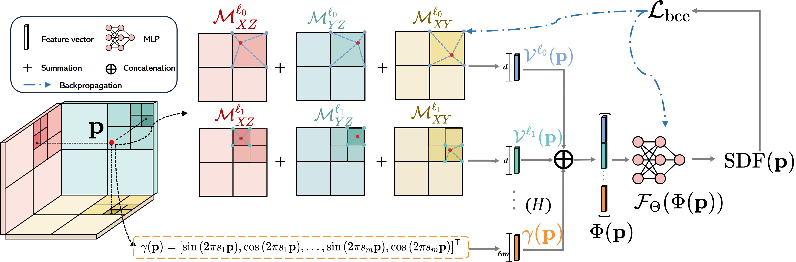
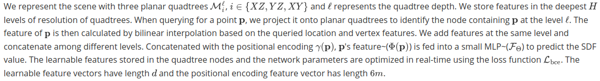

# 3QFP
<p align="center">
  	<h2 align="center">
      3QFP: Efficient neural implicit surface reconstruction using Tri-Quadtrees and Fourier feature Positional encoding [ICRA24]
	</h2>
	<h2 align="center">
        <a href="https://arxiv.org/abs/2401.07164">Arxiv</a>
	</h2>
</p>

# Overview

**Overview of our method.**
<p align="center">
    <a href="">
    	
    </a>
    <a href="">
        
    </a>
</p>

<!-- We represent the scene with three planar quadtrees $\mathcal{M}_{i}^{\ell}$, $i \in \{XZ,YZ,XY\}$ and $\ell$ represents the quadtree depth. We store features in the deepest $H$ levels of resolution of quadtrees. When querying for a point $\mathbf{p}$, we project it onto planar quadtrees to identify the node containing $\mathbf{p}$ at the level $\ell$. The feature of $\mathbf{p}$ is then calculated by bilinear interpolation based on the queried location and vertex features. We add features at the same level and concatenate among different levels. Concatenated with the positional encoding $\gamma(\mathbf{p})$, $\mathbf{p}$'s feature~($\Phi(\mathbf{p})$) is fed into a small MLP~($\mathcal{F}_\Theta$) to predict the SDF value. The learnable features stored in the quadtree nodes and the network parameters are optimized in real-time using the loss function $\mathcal{L}_{\text{bce}}$. The learnable feature vectors have length $d$ and the positional encoding feature vector has length $6m$. -->

# Installation
The code is based on the implementation of nice work [SHINE-Mapping](https://github.com/PRBonn/SHINE_mapping), so we suggests the same way to install:
- Create a conda environment:
```
conda create --name shine python=3.7
conda activate 3qfp
```

- Install torch-related things
```
pip install torch==1.12.1+cu116 torchvision==0.13.1+cu116 torchaudio==0.12.1 --extra-index-url https://download.pytorch.org/whl/cu116
pip install kaolin==0.12.0 -f https://nvidia-kaolin.s3.us-east-2.amazonaws.com/torch-1.12.1_cu116.html
```
Other torch versions should also work.

- Install other dependencies
```
pip install open3d scikit-image wandb tqdm natsort pyquaternion pyyaml torch_scatter==2.1.0
pip install git+https://github.com/NVlabs/tiny-cuda-nn/#subdirectory=bindings/torch # for ff encoding
```

# Dataset
Also, similarly, we suggest the download scripts from SHINE-Mapping.
- `MaiCity` dataset
```
sh ./scripts/download_maicity.sh
```
- `KITTI` dataset
```
sh ./scripts/download_kitti_example.sh
```
- `Newer College`
```
sh ./scripts/download_ncd_example.sh
```
In the configuration (.yaml) files, you can specify the dataset path.

`pc_path`: the folder containing the point cloud (.bin, .ply or .pcd format) for each frame.
`pose_path` : the pose file (.txt) containing the transformation matrix of each frame.
`calib_path` : the calib file (.txt) containing the static transformation between sensor and body frames (optional, would be identity matrix if set as '').

# Run
`python run.py ./config/maicity/maicity_batch.yaml`